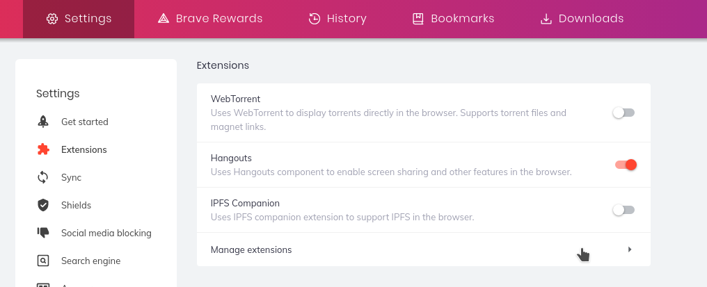
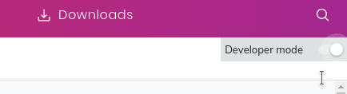
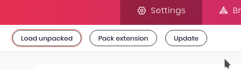

# DeepL Chrome Extension
The Brave Browser Extension that provides an iFrame of the DeepL Translator. 

This extension may be a reasonable replacement for the Google Translator since the DeepL Translator has a better privacy policy. 
You can easily verify that no one collects the data you enter in the DeepL Chrome Extension, except the DeepL company, of course, because the amount of code is tiny.

#### Installation into Brave Browser
1. In Brave Browser settings, open the Extensions tab and then press on Manage Extensions.  

2. Turn on the Developer Mode.  

3. Press the Load Unpacked button and select the root directory of this repository.  

---
It is a fork of the original project. Here, the language pair is set to EN-RU, since my primary language is Russian.
